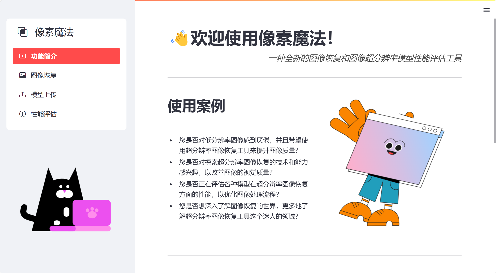

# 像素魔法

欢迎使用像素魔法，这是一个全新的图像恢复和图像超分辨率模型性能评估工具。

## 项目简介

像素魔法是一个用于图像恢复和图像超分辨率的工具，旨在提供高质量的图像处理方案以及高效的图像超分辨率模型的性能评估工具。

### 图像恢复

通过使用轻量级图像恢复模型Restormer，它是一种高效的Transformer模型，通过在多头注意力和前馈网络中构建几个关键设计，使其能够捕捉长距离的像素交互，同时仍然适用于大图像。Restormer在几个图像恢复任务上取得了较为先进的结果，它可以实现图像去雨去噪，以及图像去模糊等功能。通过嵌入Restormer模型，用户可以轻松地感受到图像恢复的神奇效果。关于 Restormer 的详细信息在[这里](https://github.com/swz30/restormer)。

### 图像超分辨率性能评估工具

这里提供了图像超分辨率模型的性能评估工具，其中包括超分辨率领域常用的定量评估方法，如PSNR（峰值信噪比）和SSIM（结构相似性），以及新兴的学习感知图像块相似度（LPIPS）指标和局部归因图（LAM）。

其中，PSNR和SSIM为超分辨率领域常用的定量评估方法，这里使用PSNR的计算方式可参考[维基百科 - 峰值信噪比](https://en.wikipedia.org/wiki/Peak_signal-to-noise_ratio) ，SSIM的计算方式与发布的官方 MATLAB 代码一致，可在 [这里](https://ece.uwaterloo.ca/~z70wang/research/ssim/) 获取。

而新兴的学习感知图像块相似度（LPIPS）是一种衡量图像相似度的方法，它通过深度学习模型来评估两个图像之间的感知差异。LPIPS 认为，即使两个图像在像素级别上非常接近，人类观察者也可能将它们视为不同。LPIPS 比传统方法（比如L2/PSNR, SSIM, FSIM）更符合人类的感知情况，如下图所示。其中，LPIPS的值越低表示两张图像越相似，反之，则差异越大。关于 LPIPS 的更多信息，请访问 [这里](https://github.com/richzhang/PerceptualSimilarity)。

局部归因图（LAM）旨在使用局部归因图理解和可视化图像超分辨率（SR）网络，通过寻找对SR结果有重要影响的输入图像的像素，如具有规则条纹或网格的纹理更容易被SR网络捕捉到，而复杂的语义则难以被利用。关于 LAM 的更多信息，请点击 [这里](https://arxiv.org/abs/2011.11036) 查看。

其中，模型性能评估所采用的数据集为Set5，点击[这里](https://drive.google.com/drive/folders/1pRmhEmmY-tPF7uH8DuVthfHoApZWJ1QU?usp=sharing)可以获取。

## 功能特点

- 图像恢复：可实现图像去雨去噪，去模糊等多项图像处理功能。
- 图像超分辨率（SR）网络性能评估：不仅提供对图像处理结果的性能评估，而且支持对SR网络的评估。
- 高质量处理：采用先进的算法和技术，确保图像处理的质量和准确性，确保模型评估结果的有效行。
- 用户友好界面：简单易用的界面，使用户能够轻松操作和控制图像处理过程。

## 安装方法

用户可以通过网站访问并使用像素魔法。

## 使用说明

像素魔法共设计了四个用户友好的交互页面。

1. 功能简介页面，即为欢迎页面，在此页面设有使用教程，可供初试者查阅。
2. 图像恢复页面，用户可以上传需要处理的图片，选择要进行的操作，包括图像去雨，运动去模糊，单图像散焦去模糊，高斯灰度去噪， 高斯彩色去噪五种功能，而且支持用户自定义恢复后图片保存的地址。
3. 模型上传页面，有需要进行图像超分辨率（SR）模型的性能评估工作的研究者，可以在此页面上传自己的SR模型，用于后续评估。
4. 性能评估页面，在此页面用户可以选择不同的SR模型进行评估，本系统内存有若干个经典的CNN模型以及最新的Transformer模型供用户选择参与评估。评估完成后用户可查看不同指标的可视化结果，以帮助用户评估模型性能的优劣。而且如果用户已成功上传自己的模型，在此页面也可以选择自己的模型进行评估。

注意：由于评估图像超分辨率模型可能需要消耗较长时间，评估大型网络可能需要更多的计算资源和耐心。

## 贡献方式

如果你对像素魔法感兴趣并希望做出贡献，可以考虑以下方式：

- 反馈问题：如果你在使用过程中遇到任何问题，请提供反馈，我们将不断改进和优化。
- 提交建议：如果你有任何关于功能改进或新特性的建议，请随时与我们分享。
- 参与开发：如果你是开发人员，并且对图像处理有深入的了解，你可以参与到像素魔法的开发中来。

请通过以下方式联系我们：

- 邮箱：TlomlZQ@gmail.com
- GitHub仓库：https://github.com/pixelmagic

## 许可证

该项目基于 [MIT 许可证](https://chat18.aichatos.xyz/LICENSE)，请查阅许可证文件获取更多信息。

------

感谢您选择使用像素魔法！我们希望这个工具能够帮助您实现出色的图像处理效果，帮助您评估图像超分辨率模型。如有任何问题或建议，请随时与我们联系。祝您使用愉快！

作者：[Your Name](https://github.com/yourname)

